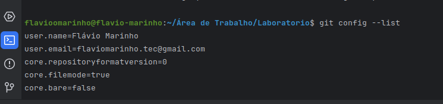
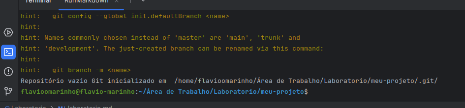
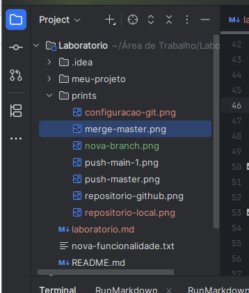
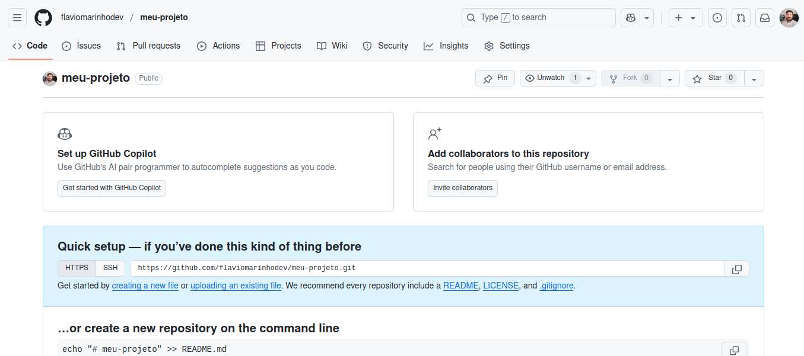
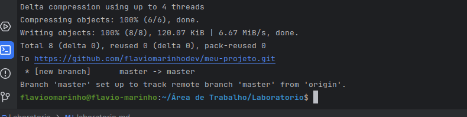
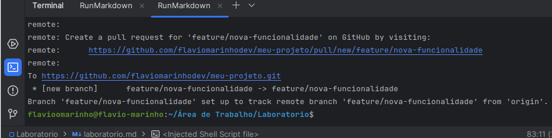
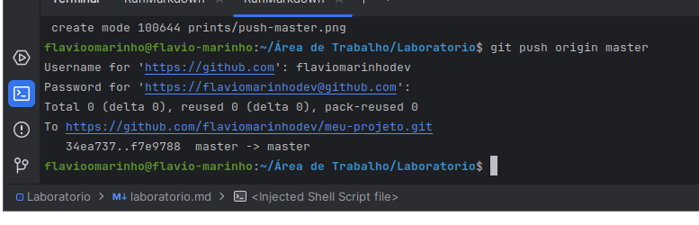

# Laboratório Prático - Git e GitHub

**Nome:** Flávio da Rosa Marinho  
**Data:** 2025-05-16

---

## 1. Configuração Inicial do Git

```bash
git config --global user.name "Flávio da Rosa Marinho"
git config --global user.email "flaviomarinho.tec@gmail.com"
```

✅ Git configurado com sucesso.

**Print do terminal:**

---

## 2. Criar um Repositório Local

```bash
mkdir meu-projeto
cd meu-projeto
git init
```

✅ Repositório local criado com sucesso.

**Print do terminal:**  

---

## 3. Adicionar Arquivos e Fazer Commit

```bash
echo "# Meu Projeto" > README.md
git status
git add README.md
git commit -m "Primeiro commit: adiciona README.md"
```

✅ Arquivo criado e commit realizado.

**Prints do terminal:**



---

## 4. Criar um Repositório no GitHub

✅ Repositório `meu-projeto` criado no GitHub (público, sem arquivos adicionados na criação).

**Print da tela do GitHub:**  

---

## 5. Conectar o Repositório Local ao GitHub

```bash
git remote add origin https://github.com/flaviomarinhodev/meu-projeto.git
git push -u origin master
```

✅ Repositório local conectado ao remoto com sucesso.

**Print do terminal:**  

---

## 6. Criar e Trabalhar em uma Nova Branch

```bash
git checkout -b feature/nova-funcionalidade
echo "Nova funcionalidade em desenvolvimento" > nova-funcionalidade.txt
git add nova-funcionalidade.txt
git commit -m "Adiciona nova funcionalidade"
git push -u origin feature/nova-funcionalidade
```

✅ Nova branch criada, funcionalidade adicionada e enviada ao GitHub.

**Prints do terminal:**

- Criando a branch e o arquivo:  
  

---

## 7. Fazer Merge da Branch na Master

```bash
git checkout master
git pull origin master
git merge feature/nova-funcionalidade
git push origin master
```

✅ Branch mesclada com sucesso na `master`.

**Prints do terminal:**

- Merge e push:  
  
---

## ✅ Conclusão

Neste laboratório, você praticou os principais comandos do Git e GitHub:

- Inicializou um repositório local
- Fez commits
- Conectou ao GitHub
- Trabalhou com branches e realizou um merge

Repositório no GitHub: https://github.com/flaviomarinhodev/meu-projeto/)

---
